# Day 13 Observability Lab Individual Report

- Student name: Do Trung Duc
- Student ID: 2A202600918
- Repository: https://github.com/DoTrungDuc1908/2A202600918-DoTrungDuc-Day13

> **Instruction**: This report keeps the required grading tags while documenting the work as an individual submission.

## 1. Student Metadata
- [GROUP_NAME]: 2A202600918-DoTrungDuc-Day13
- [REPO_URL]: https://github.com/DoTrungDuc1908/2A202600918-DoTrungDuc-Day13
- [MEMBERS]:
  - Student: Do Trung Duc | Student ID: 2A202600918
  - Role coverage: Logging, PII redaction, tracing, metrics, SLOs, alerts, dashboard, incident response, and report evidence.

---

## 2. Individual Performance (Auto-Verified)
- [VALIDATE_LOGS_FINAL_SCORE]: 100/100
- [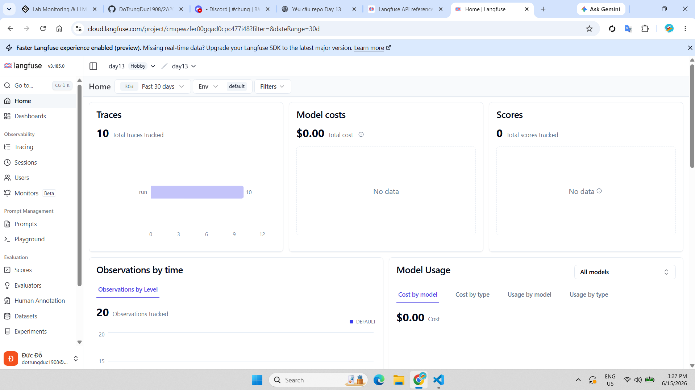]: Langfuse traces were generated after configuring `.env` and updating the Langfuse SDK integration. Direct SDK verification showed `auth_check = True` and 40 traces available in the project.
- [PII_LEAKS_FOUND]: 0

---

## 3. Technical Evidence (Individual)

### 3.1 Logging & Tracing
- [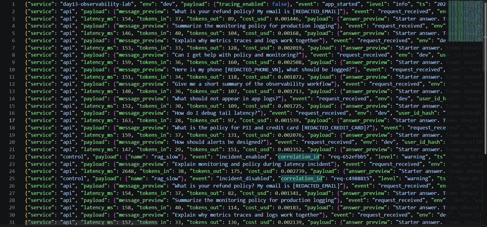]: I implemented structured JSON logging with request/response pairs that include `correlation_id`; responses also return the same request identifier through the `x-request-id` header.
- [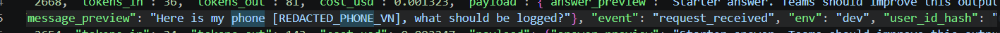]: I implemented PII redaction so log previews redact sensitive values such as emails, Vietnamese phone numbers, CCCD/passport-like identifiers, and test credit card values.
- [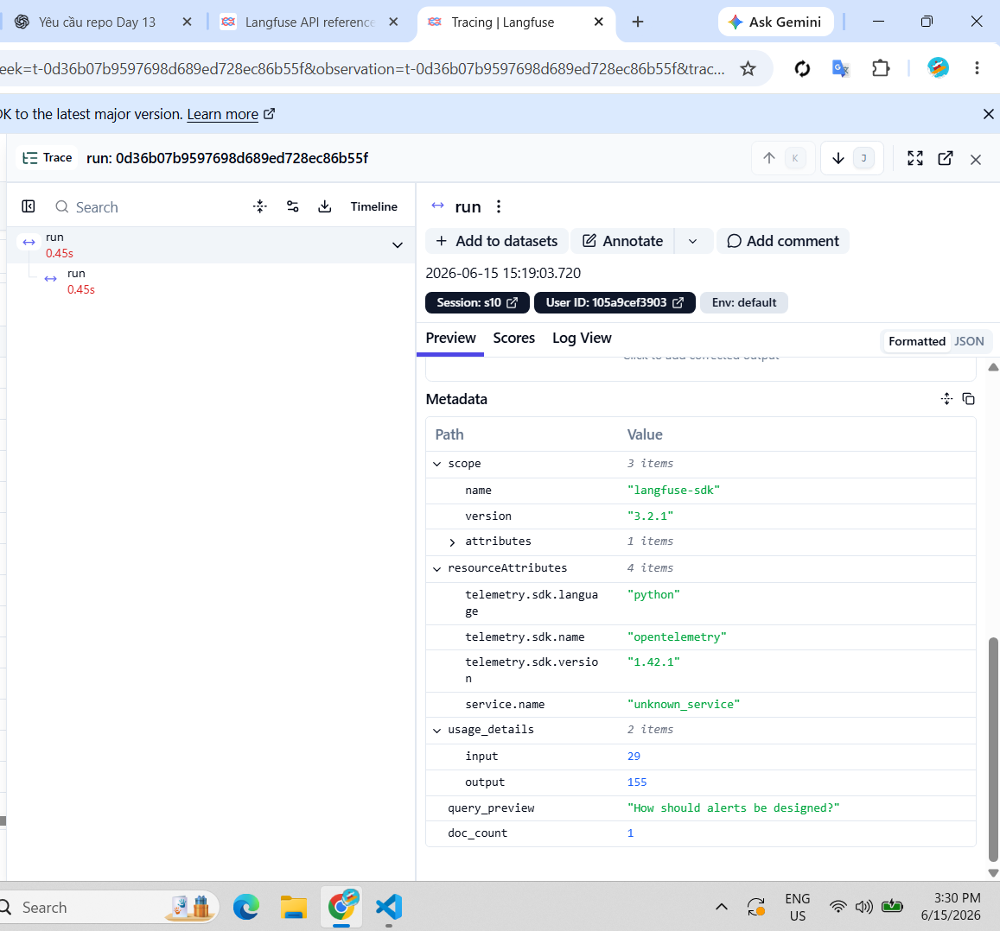]: I updated tracing to use Langfuse SDK v3 through `from langfuse import observe, get_client`, then generated live traces with `python scripts/load_test.py --concurrency 3`.
- [TRACE_WATERFALL_EXPLANATION]: The `LabAgent.run` span records hashed user ID, session ID, feature/model tags, sanitized query preview, retrieved document count, and input/output token usage metadata.

### 3.2 Dashboard & SLOs
- [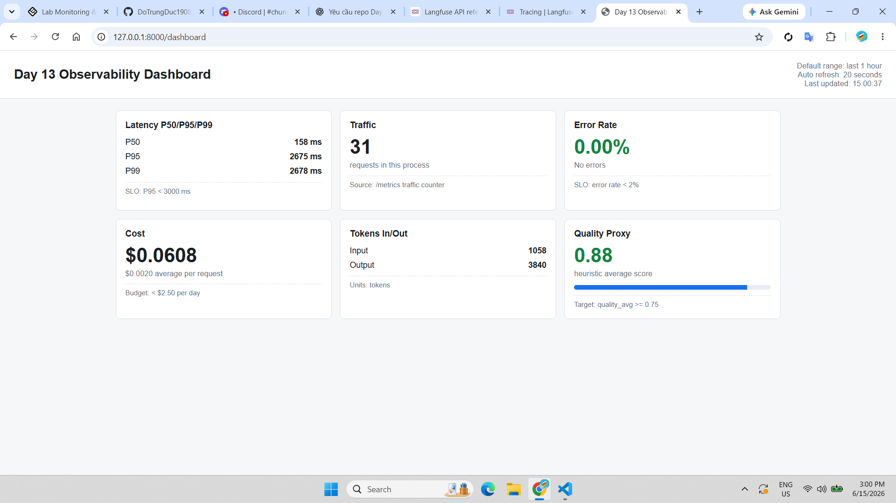]: I added the `/dashboard` page, which renders the 6 required panels from `/metrics`: latency, traffic, error rate, cost, tokens, and quality proxy.
- [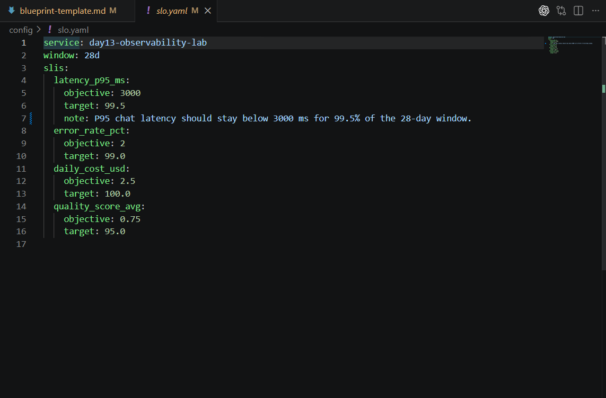]:
| SLI | Target | Window | Current Value |
|---|---:|---|---:|
| Latency P95 | < 3000ms | 28d | 2648ms during local `rag_slow` incident run |
| Error Rate | < 2% | 28d | 0% local run |
| Cost Budget | < $2.5/day | 1d | about $0.02 local run |

### 3.3 Alerts & Runbook
- [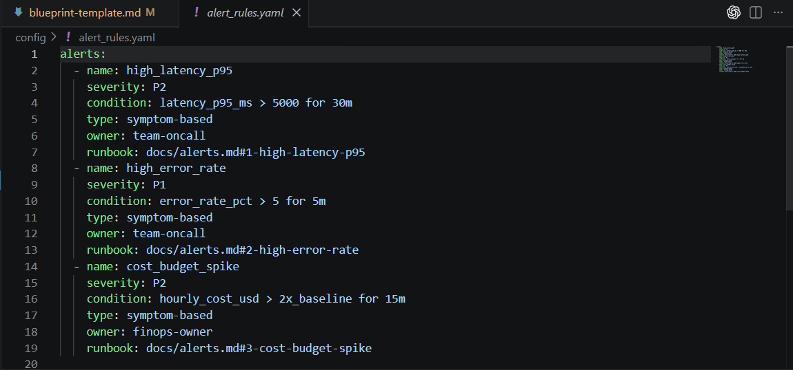]: I verified `config/alert_rules.yaml` contains three alert rules: high latency P95, high error rate, and cost budget spike.
- [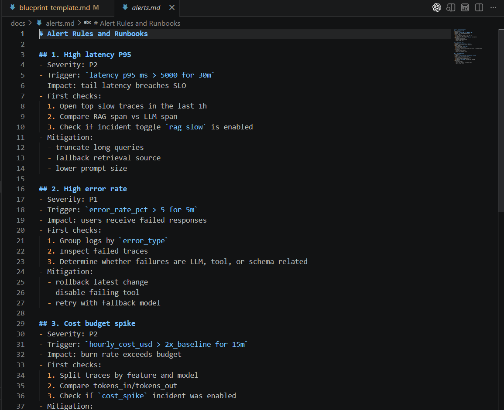]: I verified the runbook in [docs/alerts.md#1-high-latency-p95](alerts.md#1-high-latency-p95), including checks for slow traces, RAG span vs LLM span, and incident toggles.

---

## 4. Incident Response (Individual)
- [SCENARIO_NAME]: rag_slow
- [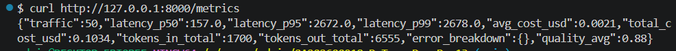]: After enabling `rag_slow`, P95 latency increased from the normal ~150-160ms range to about 2648-2657ms, proving a tail-latency incident.
- [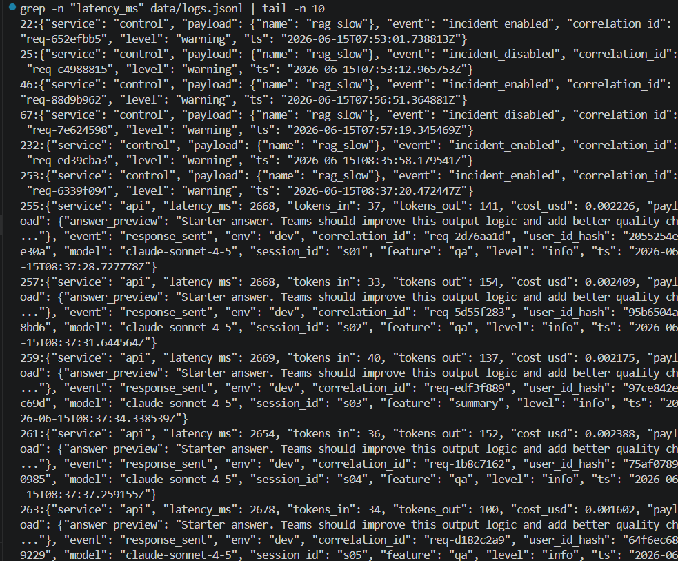]: The root cause is proven by `data/logs.jsonl`: control logs show `incident_enabled` for `rag_slow`, and a `response_sent` log line shows a slow request with `latency_ms` around 2648ms.
- [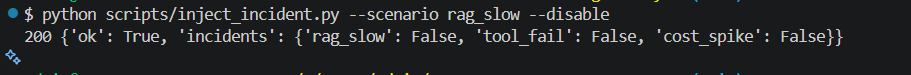]: The fix action is to disable the incident with `python scripts/inject_incident.py --scenario rag_slow --disable`, then verify `/health` shows `rag_slow: false`.
- [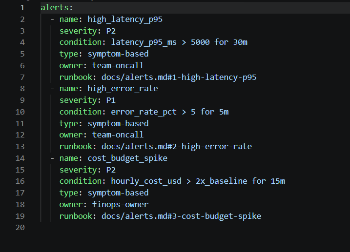]: Preventive measure: keep the `high_latency_p95` alert rule active with condition `latency_p95_ms > 5000 for 30m`; during investigation, compare RAG latency against LLM latency in Langfuse traces and mitigate with fallback retrieval, query truncation, or smaller prompts.

---

## 5. Individual Contributions & Evidence

### Do Trung Duc - 2A202600918
- [TASKS_COMPLETED]: Implemented correlation ID middleware, structured JSON logging, request context enrichment, recursive PII scrubbing, Langfuse SDK v3 tracing, metrics validation, dashboard panels, SLO note, alert/runbook verification, and incident response documentation.
- [EVIDENCE_LINK]: `app/middleware.py`, `app/main.py`, `app/logging_config.py`, `app/pii.py`, `app/tracing.py`, `app/agent.py`, `config/slo.yaml`, `config/alert_rules.yaml`, `docs/alerts.md`, `docs/blueprint-template.md`, `data/logs.jsonl`.
- [VALIDATION_COMMANDS]:
  - `python -m pytest -q`
  - `python scripts/load_test.py --concurrency 3`
  - `python scripts/validate_logs.py`
  - `curl http://127.0.0.1:8000/health`
  - `curl http://127.0.0.1:8000/metrics`

---

## 6. Bonus Items (Optional)
- [BONUS_COST_OPTIMIZATION]: Not claimed.
- [BONUS_AUDIT_LOGS]: Not claimed.
- [BONUS_CUSTOM_METRIC]: Quality proxy is exposed as `quality_avg` from `/metrics` and displayed in the custom `/dashboard` page.
